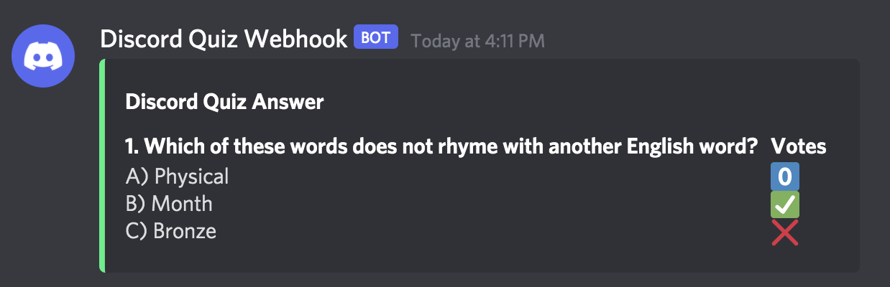
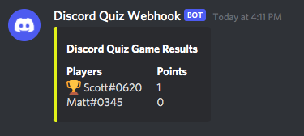

# Discord Quiz

## Top Level Description
Discord Quiz is a Discord bot written in Python 3 that enables users to host multi-player, timed, multiple choice trivia quiz games with custom questions in a server.

## Background

I first wrote a prototype of this bot back in the Summer of 2018 before my junior year of high school. I had just taken Introduction to Computer Science and as an avid trivia player at the time, I wanted to write a bot so I could host and play trivia games with fellow trivia fanatics that I met on Discord. The bot was able to support dozens of trivia games among our group of 60+ trivia players.

Recently, in the Summer of 2021, I decided to revisit this project and with the knowledge that I have gained about programming since first creating this project, have decided to go back and rewrite the code so that it is easier to read and employs better programming techniques. I have replaced previous atrocities such as hard-code and lack of function calls with a much cleaner and more efficient modular object-oriented structure.

## More Detailed Description

When hosting a game, the host can specify how many questions they want, how many answer choices to give for each question, and how long everyone will have to answer the question. Players can submit an answer by typing the letter of the option choice that they think is correct. At the end of a question, how everyone voted will be revealed. At the very end, a leaderboard will be shown with how many questions each player answered correctly.





## Installation and Deployment

```
pip3 install discord dhooks
git clone https://github.com/JChenster/discord_quiz/
```

Follow the steps outlined in `constants.py`, input the necessary information into the file, and save to connect the bot with your server.

```
python3 main.py
```

## Commands

### For the game host:

`!startgame` — Set up a game. Bot will prompt you for all the necessary inputs

`!startreg` — Begin registration for a game

`!endreg` — End registration for a game, preventing further players from joining

`!question` — Display the next question

`!result` — Display the results of the most recent question

`!endgame` — End the current game and display the leaderboard

### For players:

`!checkhost` — Check to see if they have the role to host trivia games themselves

`!checkgame` — Check to see if a game is currently active

`!checkplayers` — Check to see what players are playing in the current game

`!join` — Join the current game

`!t` — Check the timer for how much time is left to answer a question
